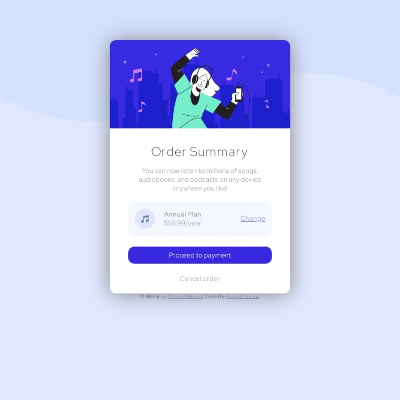

# Frontend Mentor - Order summary card solution

This is a solution to the [Order summary card challenge on Frontend Mentor](https://www.frontendmentor.io/challenges/order-summary-component-QlPmajDUj). Frontend Mentor challenges help you improve your coding skills by building realistic projects. 

## Table of contents

- [Overview](#overview)
  - [The challenge](#the-challenge)
  - [Screenshot](#screenshot)
  - [Links](#links)
- [My process](#my-process)
  - [Built with](#built-with)
  - [What I learned](#what-i-learned)
  - [Continued development](#continued-development)
  - [Useful resources](#useful-resources)
- [Author](#author)

**Note: Delete this note and update the table of contents based on what sections you keep.**

## Overview

### The challenge

Users should be able to:

- See hover states for interactive elements

### Screenshot

### Links

- Solution URL:(https://github.com/StaniStuff/Practice/tree/master)
- Live Site URL:(https://stanistuff.github.io/Practice/)

## My process

### Built with

- HTML5
- CSS custom properties
- Flexbox
- Mobile-first workflow

### What I learned

I learned how to use flexbot a bit better way. Before this task I was used to used grid for everything, but this time I deep dived into flex

### Continued development

I would I like to use grid, and flexbox together more, and create even more responsive basic sites with them.

### Useful resources

- [Flexbox CSS In 20 Minutes](https://www.youtube.com/watch?v=JJSoEo8JSnc&t) - An amazing video which showed me the basic concepts of Flex.

## Author

- Frontend Mentor - [Stani](https://www.frontendmentor.io/profile/StaniStuff)

